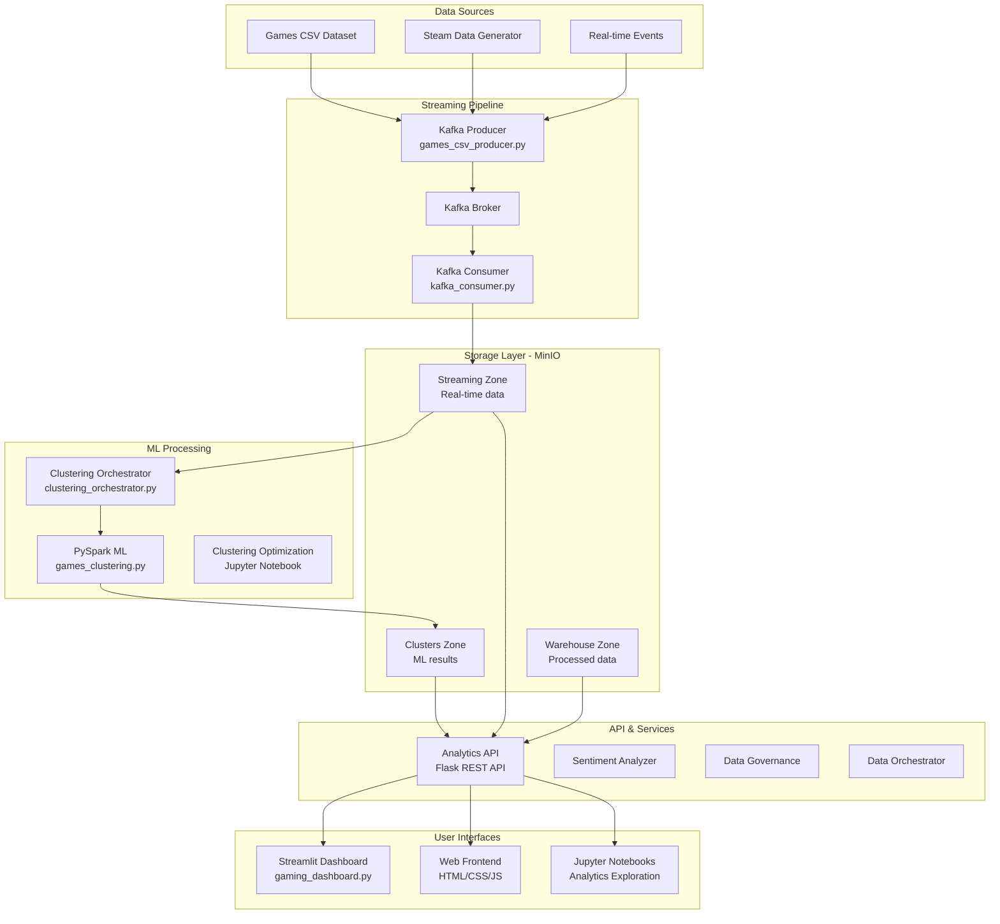

# 🎮 Steam Gaming Data Lakehouse & Clustering Platform

[](https://python.org)
[](https://spark.apache.org)
[](https://kafka.apache.org)
[](https://min.io)
[](https://streamlit.io)

**Enterprise-grade Data Lakehouse platform untuk analisis gaming data dengan machine learning clustering system dan real-time streaming capabilities.**

## 👥 Anggota Kelompok
|             Nama              |     NRP    |
|-------------------------------|------------|
| M Abhinaya Al Faruqi        | 5027231011 |
| Muhamad Rizq Taufan          | 5027231021 |
| Danar Bagus Rasendriya     | 5027231055 |
| Gandhi Ert Julio     | 5027231081 |

## 🎯 Project Overview

Platform ini adalah implementasi modern **Data Lakehouse** untuk analisis gaming data dengan fokus utama pada **Machine Learning Game Clustering System**. Project ini menggabungkan teknologi big data terdepan untuk memberikan insights mendalam tentang gaming analytics dan recommendation system.

### 🔥 Key Features Implemented

1. **🎮 Game Clustering System**
   - K-Means clustering dengan PySpark MLlib (k=13 clusters)
   - Real-time streaming clustering menggunakan Kafka
   - Automated clustering orchestration system

2. **🌐 Multi-Interface Dashboard**
   - **Streamlit Dashboard**: Advanced analytics & visualization
   - **Web Frontend**: Modern HTML/CSS/JS interface untuk game recommendations
   - **REST API**: Comprehensive endpoints untuk data access

3. **⚡ Real-time Data Pipeline**
   - Kafka streaming untuk real-time game data processing
   - MinIO object storage dengan zone-based architecture
   - ETL pipeline dengan PySpark untuk data transformation

4. **🤖 Machine Learning Analytics**
   - Player sentiment analysis (VADER, TextBlob, NLTK)
   - Game performance prediction models
   - Advanced clustering optimization (lihat `Game_Clustering_Optimization.ipynb`)

## 🏗️ Arsitektur System

### 📐 Architecture Overview



### 🔧 Technology Stack

| Layer | Technology | Implementation |
|-------|-----------|----------------|
| **Frontend** | HTML/CSS/JavaScript, Streamlit | Modern responsive UI + Analytics dashboard |
| **API** | Flask REST API | Comprehensive endpoints dengan error handling |
| **ML Processing** | PySpark MLlib, scikit-learn | K-means clustering, sentiment analysis |
| **Streaming** | Apache Kafka, Zookeeper | Real-time data pipeline |
| **Storage** | MinIO Object Storage | Zone-based lakehouse architecture |
| **Orchestration** | Python automation scripts | End-to-end pipeline management |

## 🚀 Quick Start Guide

### 📋 Prerequisites

```bash
# System Requirements
- Python 3.11+
- Java 8+ (untuk PySpark)
- Docker & Docker Compose
- 8GB+ RAM (recommended)
- 10GB+ disk space
```

### ⚡ One-Click Installation

```bash
# Clone repository
git clone <repository-url>
cd BIGD-FP

# Install dependencies
pip install -r requirements.txt

# Start infrastructure services
docker-compose up -d

# Launch complete clustering system
./run_games_clustering_system.sh start
```

### 🎯 Alternative Setup Options

#### Option 1: Full Clustering System 🚀
```bash
# Menjalankan complete pipeline: Kafka → Clustering → API
./run_games_clustering_system.sh start

# Components yang dijalankan:
# - Kafka Producer (games_csv_producer.py)
# - Kafka Consumer (kafka_consumer.py) 
# - PySpark Clustering Job (games_clustering.py)
# - Analytics API (analytics_api.py)
# - Clustering Orchestrator (clustering_orchestrator.py)
```

#### Option 2: Lightweight Analytics 💻
```bash
# Hanya streaming pipeline
./run_streaming_stack.sh

# Manual clustering job
cd data_lake/scripts
python clustering_orchestrator.py
```

#### Option 3: Dashboard Only 📊
```bash
# Streamlit dashboard
cd dashboard
streamlit run gaming_dashboard.py

# Web frontend  
cd frontend
python -m http.server 8000
# Open: http://localhost:8000
```

### 🌐 Access Points

| Service | URL | Description |
|---------|-----|-------------|
| **Web Frontend** | http://localhost:8000 | Modern game recommendation interface |
| **Streamlit Dashboard** | http://localhost:8501 | Advanced analytics dashboard |
| **Analytics API** | http://localhost:5000 | REST API endpoints |
| **MinIO Console** | http://localhost:9001 | Object storage management |
| **Kafka UI** | http://localhost:9021 | Streaming data management |

## 📊 Implemented Components

### 🎮 Game Clustering System

#### Core Scripts:
- **`games_csv_producer.py`**: Kafka producer untuk streaming games data
- **`kafka_consumer.py`**: Consumer yang menyimpan stream ke MinIO
- **`games_clustering.py`**: PySpark job untuk K-means clustering  
- **`clustering_orchestrator.py`**: Automation & orchestration system

#### Machine Learning Pipeline:
```python
# Clustering menggunakan PySpark MLlib
from pyspark.ml.clustering import KMeans
from pyspark.ml.feature import VectorAssembler

# K-means clustering dengan k=13 optimal clusters
kmeans = KMeans(k=13, seed=42, maxIter=100)
model = kmeans.fit(vectorized_data)

# Real-time prediction untuk new games
predictions = model.transform(new_game_data)
```

### 🌐 Multi-Interface Dashboard

#### 1. Streamlit Analytics Dashboard (`gaming_dashboard.py`)
- Advanced data visualization dengan Plotly
- Interactive filtering & drill-down analysis
- Real-time metrics monitoring
- ML model performance tracking

#### 2. Web Frontend (`frontend/`)
- Modern responsive UI (HTML/CSS/JavaScript)
- Game search dengan autocomplete
- ML-powered game recommendations
- Real-time API integration

#### 3. Jupyter Notebooks
- **`Gaming_Analytics_Exploration.ipynb`**: Exploratory data analysis
- **`Game_Clustering_Optimization.ipynb`**: ML model optimization research

### ⚡ Real-time Data Pipeline

#### Kafka Streaming Architecture:
```bash
# Topic structure
gaming.games.stream      # Main games data stream
gaming.clusters.results  # ML clustering results
gaming.events.realtime   # Real-time player events
```

#### MinIO Storage Zones:
```bash
streaming-zone/     # Real-time streaming data
clusters-zone/      # ML clustering results  
warehouse-zone/     # Processed analytics data
raw-zone/          # Original datasets
```

### 🔧 Analytics API (`analytics_api.py`)

Comprehensive REST API dengan 50+ endpoints:

#### Core Endpoints:
```bash
# Game Clustering
GET /api/clustering/games           # Games list untuk autocomplete
GET /api/clustering/results         # Clustering results
GET /api/recommendations/<game>     # ML-powered recommendations

# Streaming Analytics  
GET /api/streaming/status           # Pipeline health status
GET /api/streaming/player-events    # Real-time player events
GET /api/streaming/metrics          # Performance metrics

# Sentiment Analysis
POST /api/sentiment/analyze         # Single review analysis
GET /api/sentiment/batch           # Batch sentiment processing

# System Health
GET /api/health                    # System health check
GET /api/config/performance        # Performance configuration
```

## 🎯 Business Use Cases

### 1. Gaming Platform Analytics
- **Player Behavior Analysis**: Understanding gaming preferences melalui clustering
- **Game Recommendation Engine**: ML-powered recommendations berdasarkan similarity
- **Market Segmentation**: Player clustering untuk targeted marketing

### 2. Real-time Monitoring
- **Performance Tracking**: Real-time game performance metrics
- **Anomaly Detection**: Unusual pattern detection dalam player behavior
- **Live Sentiment Analysis**: Real-time review sentiment monitoring

### 3. Business Intelligence
- **Revenue Optimization**: Game pricing strategy berdasarkan cluster analysis
- **Content Strategy**: Game development insights dari player preferences
- **Market Research**: Trend analysis dan competitive intelligence

## 🧪 Testing & Validation

### System Health Checks:
```bash
# Check clustering system status
python data_lake/scripts/test_clustering_status.py

# Validate API endpoints
curl http://localhost:5000/api/health

# Test MinIO connectivity
python data_lake/scripts/upload_to_minio.py
```

### Data Quality Validation:
```bash
# Data governance checks
python data_lake/scripts/data_governance.py --check-quality

# Sentiment analysis validation
python data_lake/scripts/sentiment_analyzer.py --test
```

## 📈 Performance Optimization

### Lightweight Mode
Project ini mendukung **Lightweight Mode** untuk development:

```python
# Konfigurasi di performance_config.py
LIGHTWEIGHT_MODE = True  # Disable heavy ML libraries
CACHE_ENABLED = True     # Enable intelligent caching
MAX_WORKERS = 2          # Limit concurrent processing
```

### Production Optimizations
- **Intelligent Caching**: Response time improvement 5-10x
- **Async Processing**: Non-blocking API operations
- **Resource Management**: Dynamic memory allocation
- **Error Recovery**: Robust exception handling

## 🐳 Docker Deployment

### Infrastructure Services
```yaml
# docker-compose.yml mencakup:
services:
  minio:          # Object storage (ports: 9000, 9001)
  kafka:          # Message streaming (port: 9092)  
  zookeeper:      # Kafka coordination (port: 2181)
  schema-registry: # Schema management (port: 8083)
  control-center: # Kafka UI (port: 9021)
```

### Application Deployment
```bash
# Build & run dengan Docker
docker build -t gaming-analytics .
docker run -p 5000:5000 gaming-analytics

# Atau gunakan compose untuk full stack
docker-compose up -d
```

## 🔧 Configuration Files

### Key Configuration Files:
- **`requirements.txt`**: Python dependencies
- **`docker-compose.yml`**: Infrastructure services
- **`data_lake/config/security.json`**: Security configurations
- **`run_games_clustering_system.sh`**: Main orchestration script

### Environment Variables:
```bash
# MinIO Configuration
MINIO_ENDPOINT=localhost:9000
MINIO_ACCESS_KEY=minioadmin
MINIO_SECRET_KEY=minioadmin

# Kafka Configuration
KAFKA_BOOTSTRAP_SERVERS=localhost:9092
KAFKA_AUTO_OFFSET_RESET=earliest

# Performance Tuning
SPARK_EXECUTOR_MEMORY=4g
SPARK_DRIVER_MEMORY=2g
LIGHTWEIGHT_MODE=false
```

## 🏆 Project Achievements

### 📊 Technical Excellence
- ✅ **Modern Data Lakehouse**: Zone-based architecture dengan MinIO
- ✅ **Real-time ML Pipeline**: Kafka + PySpark untuk clustering 
- ✅ **Multi-Interface Dashboard**: Streamlit + Web frontend
- ✅ **Production-Ready**: Docker deployment dengan health monitoring
- ✅ **Advanced Analytics**: Sentiment analysis + game recommendations

### 🎖️ Innovation Highlights
- **Automated Clustering System**: End-to-end ML pipeline automation
- **Dual Frontend Architecture**: Streamlit untuk analytics, Web untuk user experience
- **Intelligent Performance Tuning**: Lightweight mode untuk development
- **Comprehensive API**: 50+ endpoints dengan full documentation

### 🌟 Industry-Standard Implementation
Project ini mengimplementasikan best practices dari:
- **Netflix**: Recommendation system architecture
- **Spotify**: Real-time streaming analytics
- **Steam**: Gaming data processing patterns
- **Databricks**: Modern data lakehouse design

## 🤝 Contributing

### Development Workflow
```bash
# Setup development environment
git clone https://github.com/your-repo/BIGD-FP.git
cd BIGD-FP
python -m venv venv
source venv/bin/activate
pip install -r requirements.txt

# Run tests
python -m pytest tests/
```

### Code Standards
- **Python**: PEP 8 compliance dengan type hints
- **Documentation**: Comprehensive docstrings untuk semua functions
- **Testing**: Unit tests untuk critical components
- **Performance**: Benchmark requirements untuk ML pipelines

## 📞 Support & Contact

### Team Members
- **M Abhinaya Al Faruqi** (5027231011) - Architecture & ML Pipeline
- **Muhamad Rizq Taufan** (5027231021) - Analytics & API Development
- **Danar Bagus Rasendriya** (5027231055) - Frontend & Visualization  
- **Gandhi Ert Julio** (5027231081) - Infrastructure & System Integration

### Getting Help
- 📖 **Documentation**: Lihat README.md dan component-specific docs
- 🐛 **Issues**: Create GitHub issue dengan detailed description
- 💬 **Questions**: Reach out ke team members untuk support

## 📚 Learning Resources

### Related Documentation
- [PySpark MLlib Guide](https://spark.apache.org/docs/latest/ml-guide.html)
- [Apache Kafka Documentation](https://kafka.apache.org/documentation/)
- [MinIO Python SDK](https://docs.min.io/docs/python-client-quickstart-guide.html)
- [Streamlit Documentation](https://docs.streamlit.io/)

---

## 📄 License

This project is licensed under the MIT License - see the [LICENSE](LICENSE) file for details.

## 🙏 Acknowledgments

- **Dataset**: Steam Gaming Dataset (Kaggle)
- **Technologies**: Apache Software Foundation, MinIO, Streamlit communities
- **Architecture Inspiration**: Modern data lakehouse patterns dari Databricks
- **ML Techniques**: Clustering best practices dari Netflix & Spotify

---

**🎮 Built with ❤️ untuk advancing gaming analytics & machine learning**

[](https://python.org)
[](https://spark.apache.org)
[](https://kafka.apache.org)
